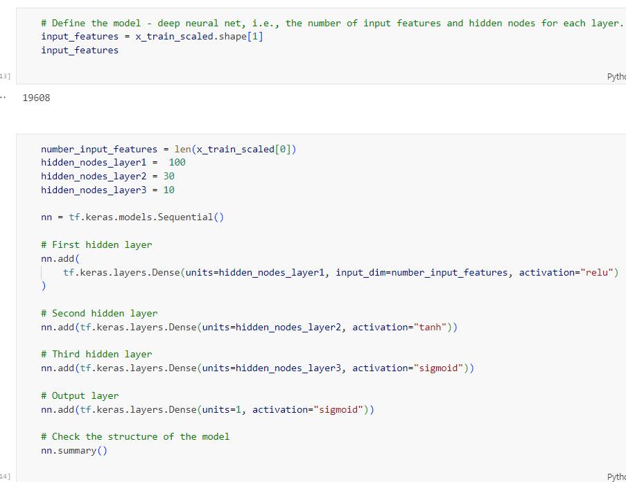

# Deep Learning Challenge Analysis Report

# Overview 

The purpose of this analysis is to build a deep neural network model that can predict whether crowdfunding projects will be successful. By preprocessing the data, creating a neural network model, training it on the training data, and evaluating its performance on the test data, the analysis aims to develop a predictive model that can assist in identifying successful projects in advance. This analysis can help stakeholders make informed decisions and allocate resources effectively to maximize the success rate of projects on the crowdfunding platform.

# Results

## Data Preprocessing

**What variable(s) are the target(s) for your model?**

The target variable for the model is the "IS_SUCCESSFUL" column in the dataset

**What variable(s) are the features for your model?**

The features for the model include all the columns in the dataset except for the target variable "IS_SUCCESSFUL." 

**What variable(s) should be removed from the input data because they are neither targets nor features?**

In the preprocessing steps, the "EIN" column was dropped from the input data as it is an identification column and not a relevant feature for the model. 

## Compiling, Training, and Evaluating the Model

**How many neurons, layers, and activation functions did you select for your neural network model, and why?**

For the neural network model in this analysis, an input layer was used with 19607 neurons based on the number of input features, 3 hidden layers consisting of; 100 neurons (ReLu), 30 Nuerons (tanh) and 10 neurons (sigmoid), and an output layer of 1 nuerons (sigmoid) allowing the model to learn the patterns of the data. 

**Were you able to achieve the target model performance?**

The model's loss is 0.4805, and the accuracy is 0.7847. This means that the model achieved an accuracy of approximately 78.47% on the test dataset. As the target was to achieve higher than 75% accuracy, the model has achieved the desired outcome.

**What steps did you take in your attempts to increase model performance?**

To increase the model performance from the original preprocessing accuracy of 72.49% as shown in `Data_Preprocessing.ipynb` I increased the model performance by increasing both the number of layers and types of layers.

***Original model***

***Optimised model***

## Summary

In summary, the deep learning model achieved an accuracy of 78.47% on the test dataset, surpassing the target of 75% accuracy. This indicates that the model performed reasonably well in classifying the data.For further learning, another machine learning models such as Random Forest could be utilised to provide additional insights and potentially improve performance further by capturing complex patterns in the data.